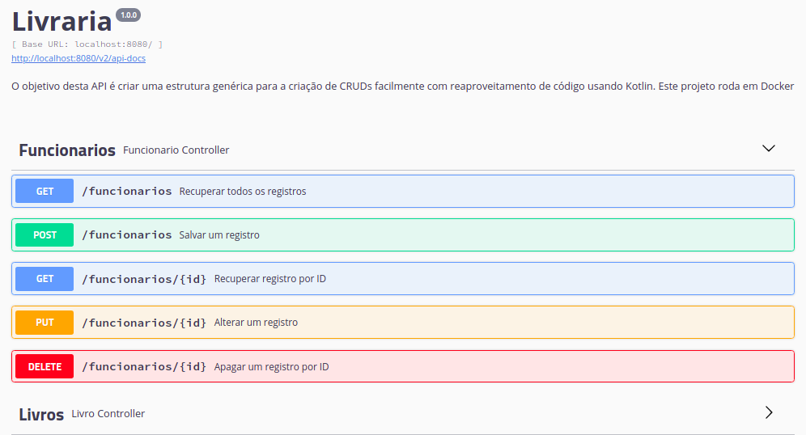

# kotlin-generic-crud

A Ideia desse projeto é fornecer uma estrutura genérica para criação de CRUDs, assim, reduzindo a repetição de código ao usar classes e tipos genéricos para reaproveitar o código.

O Projeto utiliza Kotlin, SpringBoot, Gradle, SwaggerUI e roda em Docker.
Também foi incluso um docker-compose e um script python para subir o projeto dentro de uma dockerVM.

### Como utilizar

Para criar um CRUD funcional, devemos estender (*No Kotlin, o extend é um sinal de dois pontos) as classes genéricas criadas com seus devidos Overrides.

O projeto já vem com um CRUD de uma entidade Livros, no que seria uma API de Livraria.

Vamos criar então uma entidade Funcionario. Dentro do diretório /model, crie a classe Funcionario.kt e estenda a classe **AbstractModel**, além de os overrides *get* e *set*.
Lembrando que para salvar no banco de dados, estamos utilizando as anotações JPA/javax:

```kotlin
package com.gilbertocharles.KotlinExample.model

import com.gilbertocharles.KotlinExample.model.AbstractModel
import javax.persistence.Entity
import javax.persistence.GeneratedValue
import javax.persistence.GenerationType
import javax.persistence.Id

@Entity
class Funcionario(
  @Id 
  @GeneratedValue var id: Long,
  val nome: String,
  val idade: Int) : AbstractModel() {
    override fun get() : Long {
      return this.id
    }

    override fun set(id: Long) {
      this.id = id
    } 
  }
```


Agora, crie em /repository uma classe FuncionarioRepository.kt e estenda a classe CrudRepository.
Esta classe irá se comunicar com a tabela de Funcionarios dno banco de dados

```kotlin
package com.gilbertocharles.KotlinExample.repository

import com.gilbertocharles.KotlinExample.model.Funcionario
import org.springframework.data.repository.CrudRepository

interface FuncionarioRepository : CrudRepository<Funcionario, Long> {}
```


Agora, crie em /service uma classe FuncionarioService.kt e estenda a classe abstrata AbstractService, disponível neste projeto.

Também faça a injeção do repositório e o override da função getRepository


```kotlin
package com.gilbertocharles.KotlinExample.service

import com.gilbertocharles.KotlinExample.repository.FuncionarioRepository
import com.gilbertocharles.KotlinExample.service.AbstractService
import org.springframework.beans.factory.annotation.Autowired
import org.springframework.data.repository.CrudRepository
import com.gilbertocharles.KotlinExample.model.Funcionario
import org.springframework.stereotype.Service;

@Service
class FuncionarioService() : AbstractService<Funcionario>() {
    @Autowired
    lateinit var repository: FuncionarioRepository

    override fun getRepository() : CrudRepository<Funcionario, Long> {
        return this.repository
    }
}
```


Para finalizar, crie o controller dos endpoints. Em /controller, crie uma classe FuncionarioController.kt e estenda a classe abstrata AbstractController, disponível nesse projeto. Faça a injeção do service e o override da função getService


```kotlin
package com.gilbertocharles.KotlinExample.controller

import com.gilbertocharles.KotlinExample.model.Funcionario
import com.gilbertocharles.KotlinExample.repository.FuncionarioRepository
import com.gilbertocharles.KotlinExample.service.AbstractService
import com.gilbertocharles.KotlinExample.service.FuncionarioService
import io.swagger.annotations.Api
import io.swagger.annotations.ApiImplicitParam
import io.swagger.annotations.ApiOperation
import org.springframework.beans.factory.annotation.Autowired
import org.springframework.web.bind.annotation.GetMapping
import org.springframework.web.bind.annotation.PostMapping
import org.springframework.web.bind.annotation.RequestBody
import org.springframework.web.bind.annotation.RequestMapping
import org.springframework.web.bind.annotation.RestController

@Api(value = "Api de Funcionarios", tags = ["Funcionarios"])
@RestController
@RequestMapping("Funcionarios")
class FuncionarioController : AbstractController<Funcionario>(){
    @Autowired
    lateinit var service: FuncionarioService

    override fun getService() : AbstractService<Funcionario> {
        return this.service
    }
}
```


Com isso, vemos que com apenas 4 classes simples (Model, Service, Controller e Repository) é possível ter um CRUD funcional sem a repetição de código para os métodos put, get, post e delete.


### Rodando o projeto

Supondo que tu tenha o docker e o docker-compose configurados, basta rodar o script python run.py


```shell
python run.py
```

O script irá baixar a imagem docker e buildar o projeto dentro dela. Logo após o build, o projeto estará disponível para testar utilizando os endpoints http://localhost:8080/livros ou o que criamos agora: http://localhost:8080/funcionarios
que você pode testar usando o postman.

Porém, o projeto possui o Swagger configurado, portanto, é mais simples usar os endpoints usando o link http://localhost:8080/swagger-ui.html como podemos ver abaixo:




---
<a href="https://github.com/GilbertoCharles/kotlin-generic-crud">
  
</a>

